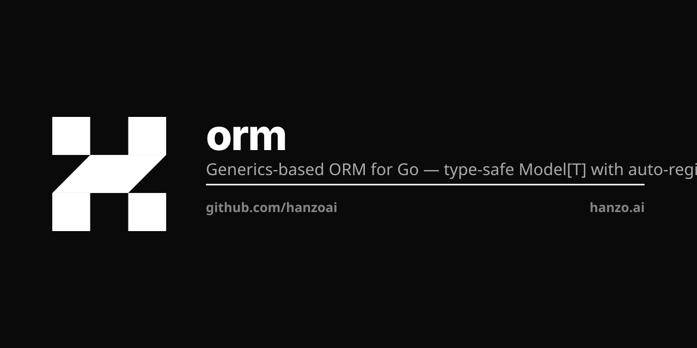

<p align="center"></p>

# orm

Generics-based ORM for Go with type-safe `Model[T]`, auto-registration, auto-serialization, and multi-backend support.

```go
import "github.com/hanzoai/orm"
```

## Install

```bash
go get github.com/hanzoai/orm@latest
```

## Quick Start

### Define a model

```go
type User struct {
    orm.Model[User]
    Name   string `json:"name"`
    Email  string `json:"email"`
    Status string `json:"status" orm:"default:active"`
}

func init() {
    orm.Register[User]("user")
}
```

### Connect to a backend

```go
import ormdb "github.com/hanzoai/orm/db"

// SQLite (embedded, zero config)
db, err := orm.OpenSQLite(&ormdb.SQLiteDBConfig{
    Path:   "data/app.db",
    Config: ormdb.SQLiteConfig{BusyTimeout: 5000, JournalMode: "WAL"},
})

// ZAP binary protocol (PostgreSQL, MongoDB, Redis, ClickHouse via sidecar)
db, err := orm.OpenZap(&ormdb.ZapConfig{
    Addr:    "localhost:9651",
    Backend: ormdb.ZapSQL,        // or ZapDocumentDB, ZapKV, ZapDatastore
})
```

### CRUD

```go
// Create
user := orm.New[User](db)
user.Name = "Alice"
user.Email = "alice@example.com"
user.Create()

// Read
got, err := orm.Get[User](db, user.Id())

// Update
got.Name = "Alice Smith"
got.Update()

// Delete
got.Delete()
```

### Query

```go
q := orm.TypedQuery[User](db)
found, err := q.Filter("Status=", "active").Get()
```

### Lifecycle Hooks

```go
func (u *User) BeforeCreate() error {
    // validate, set defaults, etc.
    return nil
}

func (u *User) AfterCreate() error {
    // send welcome email, etc.
    return nil
}
```

### Auto-Serialization

Fields with `orm:"serialize"` and a corresponding `_` storage field are automatically marshaled/unmarshaled:

```go
type Product struct {
    orm.Model[Product]
    Variants  []Variant `json:"variants" orm:"serialize" datastore:"-"`
    Variants_ string    `json:"-" datastore:"variants"`
}
```

### Struct Tag Defaults

```go
type PaymentIntent struct {
    orm.Model[PaymentIntent]
    Status   string `json:"status"   orm:"default:requires_payment_method"`
    Currency string `json:"currency" orm:"default:usd"`
}
```

### Caching

Built-in read-through cache with memory LRU and Redis/Valkey backends:

```go
orm.Register[User]("user", orm.WithCache[User](orm.CacheConfig{
    TTL:     5 * time.Minute,
    MaxSize: 10000,
}))
```

### Validation

```go
import "github.com/hanzoai/orm/val"

v := val.NewValidator()
v.CheckString("email", user.Email).Required().Email()
v.CheckString("name", user.Name).Required().MinLen(2)
if err := v.Error(); err != nil {
    return err
}
```

## Backends

| Backend | Driver | Use Case |
|---------|--------|----------|
| SQLite | `orm.OpenSQLite` | Embedded, single-node, development |
| PostgreSQL | `orm.OpenZap` + `ZapSQL` | Production SQL via ZAP sidecar |
| MongoDB/FerretDB | `orm.OpenZap` + `ZapDocumentDB` | Document storage via ZAP sidecar |
| Redis/Valkey | `orm.OpenZap` + `ZapKV` | KV storage via ZAP sidecar |
| ClickHouse | `orm.OpenZap` + `ZapDatastore` | Analytics via ZAP sidecar |

### ZAP Binary Protocol

ZAP eliminates JSON serialization overhead by encoding structs directly into a binary format over RPC. A zap-sidecar process proxies requests to the actual database backends.

```
App ──ZAP binary──▸ zap-sidecar ──native──▸ PostgreSQL/MongoDB/Redis/ClickHouse
```

Benefits:
- Zero-copy binary encoding (no JSON marshal/unmarshal for storage)
- Single ORM interface across SQL, document, KV, and columnar backends
- Native complex types (slices, maps, nested structs) without Foo/Foo_ pairs

## Packages

| Package | Description |
|---------|-------------|
| `orm` | Core `Model[T]`, registration, hooks, cache, serialization |
| `orm/db` | Database interfaces, SQLite driver, ZAP driver |
| `orm/val` | Struct field validation |
| `orm/internal/json` | JSON encode/decode helpers |
| `orm/internal/reflect` | Reflection utilities |

## Documentation

Full docs at [hanzo.ai/docs/services/orm](https://hanzo.ai/docs/services/orm)

## License

MIT
